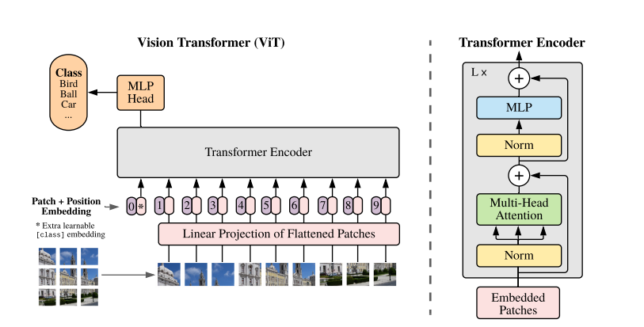
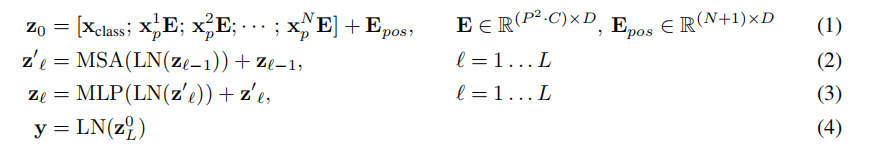
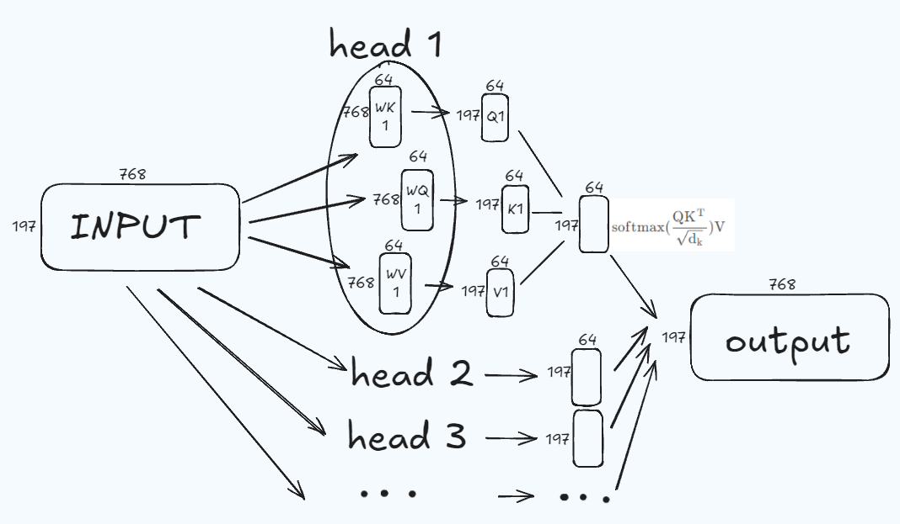
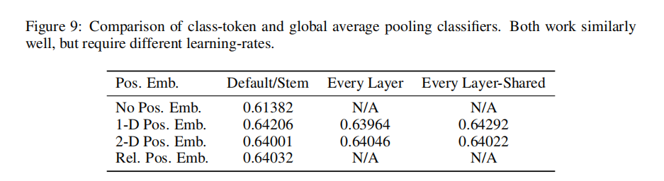
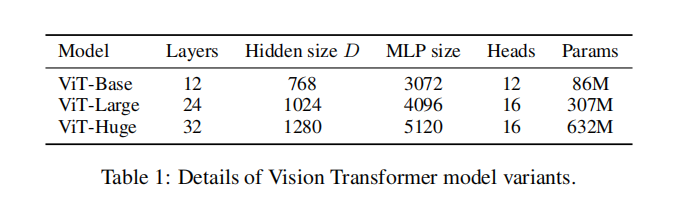
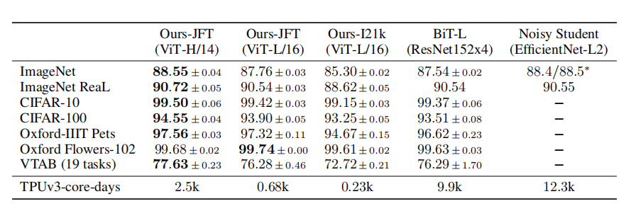
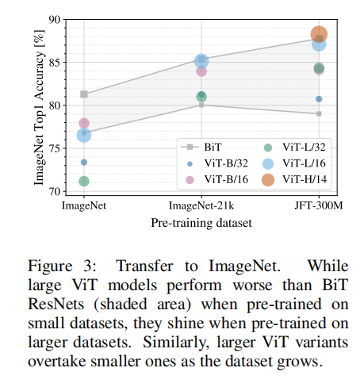
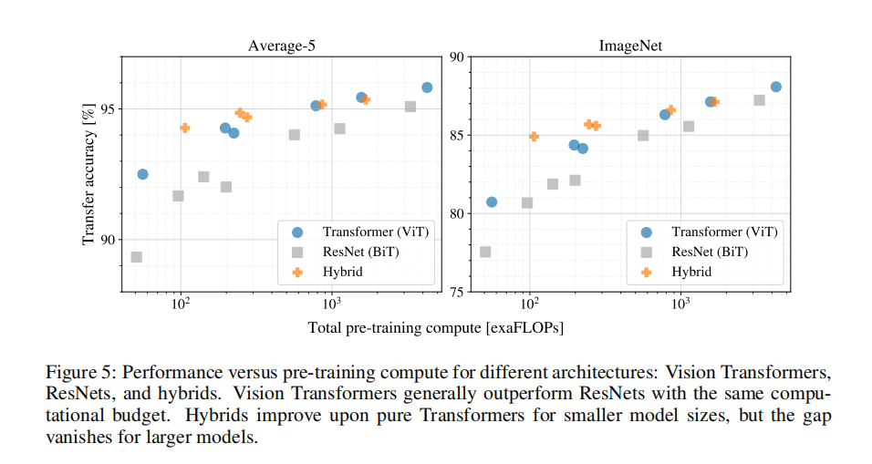

paper with code :https://paperswithcode.com/ 可以查看先进的深度学习方法和某一数据集上表现最优秀的模型
论文地址：https://arxiv.org/pdf/2010.11929/1000
李沐读论文的顺序：标题-摘要-引言-结论-相关工作-模型-实验-评论

# 标题 & 摘要
>an image is worth 16X16 words
- 一张图片等于16乘16的单词
- 意思是VIT将图片分割为16X16像素的patches

> Invision, attention is either applied in conjunction with convolutional networks, orused to replace certain components of convolutional networks while keeping theiroverall structure in place
- 传统的图像识别方法过分依赖CNN

> When pre-trained on large amounts ofdata and transferred to multiple mid-sized or small image recognition benchmarks(ImageNet, CIFAR-100, VTAB, etc.), Vision Transformer (ViT) attains excellent results compared to state-of-the-art convolutional networks while ...
- 在大数据上进行预训练再迁移到中小型数据集上时，VIT的i效果非常好（因此不再需要卷积）

# 引言INTRODUCTION
>The dominant approach is to pre-train on a large text corpus and then fine-tune on a smaller task-specific dataset
- (NLP)目前流行的方式是在大数据上预训练，然后在小数据集上进行微调

为什么transformer应用在图像上有困难？
- 对NLP，如果句子长度为n，计算的复杂度为O($n^2$)
- 对于图片，例如224X224，如果将它展开，像NLP一样进行操作，那么计算的复杂度为O($224^4$)

>Inspired by the Transformer scaling successes in NLP, we experiment with applying a standard Transformer directly to images, with the fewest possible modifications.
- 尽量使用原生Transformer，不进行过度修改

>we split an imageinto patches and provide the sequence of linear embeddings of these patches as an input to a Trans former.
- 将图片（224X224) 分割为patches，每个patch(16X16)展开作为一个元素。这样就解决了图片序列过长的问题

>We train the model on image classification in supervised fashion.
- 在NLP中通常采用无监督训练，VIT采用有监督训练

后面的两段指出，VIT**在中小型数据集（imageNet）训练的情况下，精度略小于CNNs。**
- 作者指出原因是transformer缺少归纳偏置(inductive biases)
- 归纳偏置指的是：1.相邻的元素有更强的相关性。2.平移不变性 (先移动/先卷积的结果不变)
然而，if the models are trained on larger datasets (14M-300M images)，即**用大规模数据进行与训练后，VIT的精度非常高。**

# CONCLUSION
总结本项目工作：
**采用标准transformer模型，将图片进行简单的预处理，用NLP方法直接处理CV问题**

>we interpret an image as a sequence of patches and process it by a standard Transformer encoder as used in NLP.
- 将图片理解为patches序列，类比NLP

>While these initial results are encouraging, many challenges remain. One is to apply ViT to other computer vision tasks, such as detection and segmentation.
- 本项目在图片分类上应用效果很好，下一步需要研究VIT在图像分割和检测方面的应用

>Another challenge is to continue exploring self supervised pre-training methods. Our initial experiments show improvement from self-supervised pre-training, but there is still large gap between self-supervised and large-scale supervised pre training.
- 需要在CV领域研究子监督预训练（模仿NLP）（目前的CV通常都是采用有监督的训练）

# METHOD 

## 全过程的公式表达：

其中E指的是得到的那个196X768的矩阵过了全连接层(768X768)的结果

## embedding
 将图片分割为patches，然后将每个patch展平，并加入位置编码（保证有位置信息），这样就得到了一组token，随后将这么多token输入到transformer encoder里面

 以一张图片举例，
 - 原始大小大小是224 224 3
 - 分割后得到196个16X16X3的patch,并展平，即196X768
 - patch embeddding: **乘**以一个 768X768的可学习矩阵（全连接）（**线性投影）**
 - **拼接**上一个**专门用于分类的class token**（1X768)，得到的token形状为 197 X 768 
 - Position embedding： **加**上197×768的可学习位置编码，最终输入Transformer的token形状为197×768

## Multi-Head Attention
VIT base 中采用12个头进行**多头自注意力**计算，我们为每个头维护**单独的 Q/K/V 权重矩阵**
12个头都将768维映射到64维（也就是说每个头的KQV矩阵的大小为768X64)
197 X 768的token被分为 **12组 197X64的K Q V** 
每一组的KQV进行自注意力运算后，再把结果拼起来，得到的结果仍然为197X768
	保持维度不变，这样在理论上才不会丢失信息量
	
我为整个过程绘制了简易的图片：

## MLP 
会对维度进行放大，放大四倍再投射回197X768

## 如何进行预测
>Similar to BERT’s [class] token, we prepend a learnable embedding to the sequence of embed
-ded patches (z 0 0 = xclass), whose state at the output of the Transformer encoder (z 0 L ) serves as theimage representation y
- 将class token位置的输出作为整个图像的表示向量y （形状为 1X768)

>a classification head is attached to z 0 L . The classification head is implemented by a MLP with one hidden layer at pre-training time and by a single linear layer at fine-tuning time.
- 最终将表示向量y映射到类别空间就好（例如共10个类别就映射到10位）
- 预训练阶段用MLP
- 微调阶段直接由y映射到分类类别

## 关于embeddings方式
>Position embeddings are added to the patch embeddings to retain positional information. We use standard learnable 1D position embeddings, since we have not observed significant performance gains from using more advanced 2D-aware position embeddings
- 采用的是1D编码
- 1D编码：生成可学习的197×768编码矩阵（197个位置，每个位置768维），直接与patch embeddings相加
- 2D编码：分别生成行、列编码矩阵（如14×768的行编码 + 14×768的列编码），通过相加或拼接得到最终位置编码
- 文章对两个编码方式进行了对比，发现区别不大
	

## 关于CLS 和 全局平均池化
为了得到一个图像的分类特征，作者指出加入CLS和使用全剧平均池化（GAP）都可以
但是作者秉持减小对transformer模型改动的原则，全局均采用CLS做实验

## 关于微调
>When feeding images of higher resolution, we keep the patch size the same, which results in a larger effective sequence length. The Vision Transformer can handle arbitrary sequence lengths (up to memory constraints), however, the pre-trained position embeddings may no longer be meaningful. We therefore perform 2D interpolation of the pre-trained position embeddings, according to their location in the original image. Note that this resolution adjustment and patch extraction are the only points at which an inductive bias about the 2D structure of the images is manually injected into the Vision Transformer.
- 通常如果采用更大尺度的图片进行微调效果会更好
- 但是如果尺度变大，采用相同的patch size（如16X16），那么patch的数量也会增加，这就导致了原来训练的位置编码可能无效
- 所以VIT采用了2D interpolation的方法对与预训练的位置编码进行处理，进而能够进行微调

# 实验
用到的模型：
其中D代表transformer输入的一个向量的长度

>ViT-L/16 means the “Large” variant with 16×16 input patch size
- 模型命名的方式包括模型大小和patch size
- 16表示的是一个patch的大小为16X16，即一个patch的展平大小为768,那么在patch embedding 阶段的线性投影就应该是乘以一个768X1024的全连接层、
- patch_size越小，计算越贵，因为每一个patch都要映射到1024维，但是patch的数量增加了

## 实验结果：

## 实验分析
- 图片中灰色代表各种大小的ResNet，可以理解为卷积网络的上下限
- 可以看到数据量低的情况下，VIT远不如卷积神经网络，随着数据量的增加，表现越来越好。
- 如果你想用VIT，你至少要ImageNet-21k这么大的数据集

- 在相同计算量的情况下，VIT的效果比ResNet好，这表明VIT更便宜
- 在小数据量的情况下，混合模型的效果很好

- E（就是展平得到的矩阵经过线性投影得到的结果）显示其可以描述每个图像块的底层结构🤔
- 位置编码确实可以表示距离信息，也学习到了行列规则🤔
- 随着网络的加深，自注意力距离越来越远，表明对全局信息的学习效果很好

# 自监督训练尝试
>We also perform a preliminary exploration on masked patch prediction for self-supervision, mimicking the masked language modeling task used in BERT. With self-supervised pre-training, our smaller ViT-B/16 model achieves 79.9% accuracy on ImageNet, a significant improvement of 2% to training from scratch, but still 4% behind supervised pre-training.
- 仿照Bert的形式，将一些patch遮盖，让模型根据其他patch预测这些patch
- 但是这样做精度并没有很大提升

# 个人总结
全文贯彻一个思想：**用原生transformer做CV处理**，结果发现效果确实很好
这无疑开了万物皆可transformer的先河，此后transformer从NLP渗透到CV，实现了大一统。这也进一步推动了多模态的发展。
同时一篇文章提出了n个新的研究领域，例如探索如何用自监督学习训练VIT，将VIT应用到图像分割、检测工作等等。

